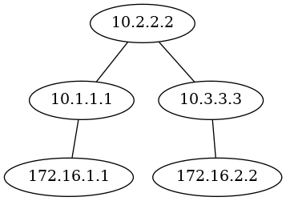

# Reporting
These playbooks gathers various information from the lab and will generate reports on the following:
* Hostname, serial number, SW version and uptime for each device
* All configured IP addresses
* NTP configuration
* Topology generated from OSPF neighbors

## Sample output

### Basic report
[Basic report](output/basic_report.html)

### OSPF topology
